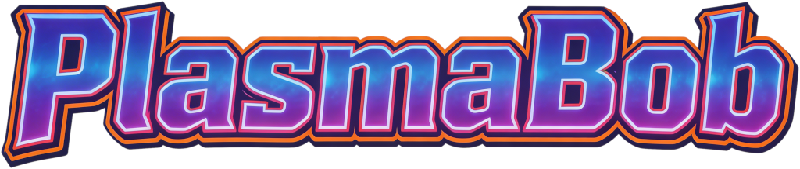
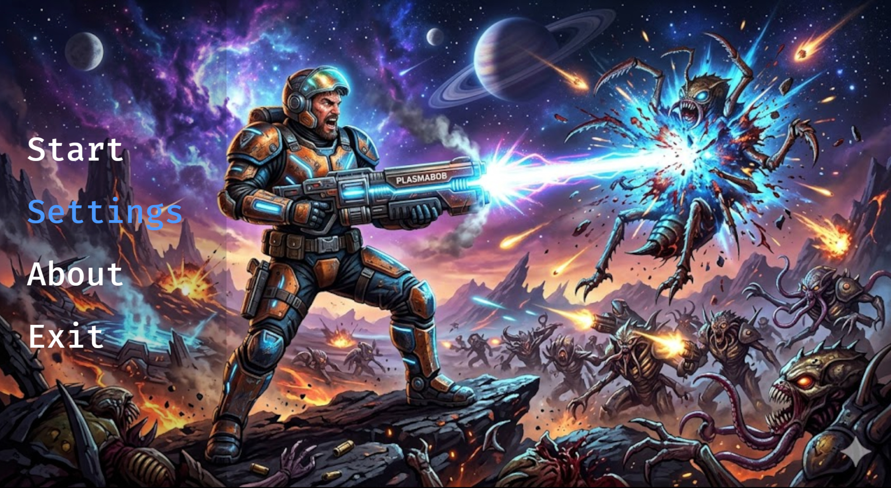
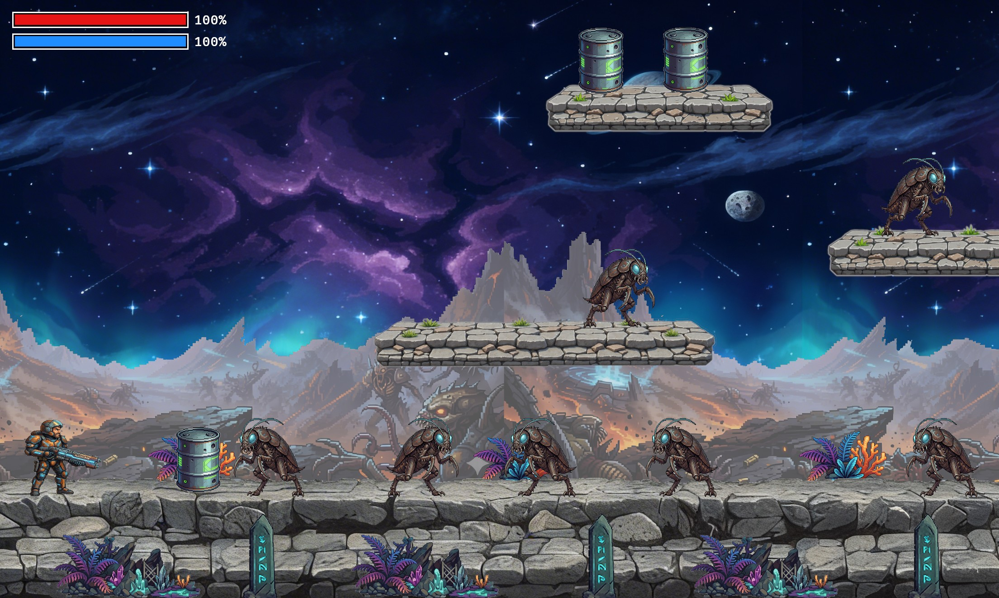

# PlasmaBob



PlasmaBob is a 2D platformer game where players control a hero named Bob to rescue the world.

This was started on a 24h hackathon at exxeta to explore the Bevy game engine and to have fun. The game is still in early development, but the basic level loading and entity system is in place.

Have Fun!

## Quick Start

Go to releases and download the latest release for your platform.

[Download the latest release](https://github.com/farion/plasmabob/releases/latest)

Note for MacOS users: https://support.apple.com/de-de/guide/mac-help/mh40616/mac

## Screenshot

### Startscreen
[](startscreen.jpg)

### Gameplay

[](gameplay2.jpg)

## Tool Usage

### Development

- IntelliJ Rust plugin
- Gimp

### AI

Of course I used AI to help me with this project. I used it to generate ideas, to write code, to debug, and to write documentation. I also used it to generate the graphical and audio assets including the music. 

AI Tools used:
- GitHub Copilot
- Gemini
- OpenArt Ai
- Suno
- ElevenLabs

## Run

Basically take one of the releases here on Github and run the executable. If you want to run it from source, you can use the following commands:

```bash
cargo run
cargo run -- level1.json
cargo run -- levels/level1.json
```

## Current level format

- Level files live under `assets/levels/`
- Coordinates use a bottom-left origin: `(0, 0)` is the lower-left corner of the screen
- `entity_types` define size, animations, and gameplay components
- `entity_types` also define `hitbox` polygons (local points, origin at entity bottom-left)
- `entities` place concrete instances into the level

## Gameplay components

Each gameplay component has its own Rust file under `src/components/`:

- `floor`
- `npc`
- `hostile`
- `player`
